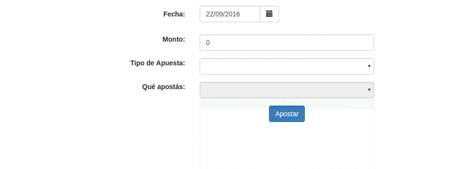

# Apuestas de una ruleta en Angular

* Permite ver combos anidados, ya que la apuesta depende del tipo de apuesta (pleno o docena)
* El dominio se implementa enteramente en javascript (puede verse la implementación del Strategy).
